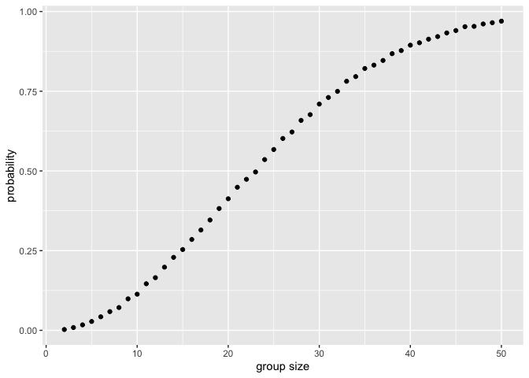

p8105_hw5_mt3866
================
2025-11-13

Load libraries

``` r
library(tidyverse)
```

    ## ── Attaching core tidyverse packages ──────────────────────── tidyverse 2.0.0 ──
    ## ✔ dplyr     1.1.4     ✔ readr     2.1.5
    ## ✔ forcats   1.0.0     ✔ stringr   1.5.1
    ## ✔ ggplot2   3.5.2     ✔ tibble    3.3.0
    ## ✔ lubridate 1.9.4     ✔ tidyr     1.3.1
    ## ✔ purrr     1.1.0     
    ## ── Conflicts ────────────────────────────────────────── tidyverse_conflicts() ──
    ## ✖ dplyr::filter() masks stats::filter()
    ## ✖ dplyr::lag()    masks stats::lag()
    ## ℹ Use the conflicted package (<http://conflicted.r-lib.org/>) to force all conflicts to become errors

``` r
library(rvest)
```

    ## 
    ## Attaching package: 'rvest'
    ## 
    ## The following object is masked from 'package:readr':
    ## 
    ##     guess_encoding

Write a function that randomly draws birthdays out of 365 days & run the
function 10000 times for each group size 2-50

``` r
sim_birthday = function (n) {
birthdays = sample(1:365, n, replace = TRUE)
any(duplicated(birthdays))
}
birthday_results = expand_grid(
  groupsize = 2:50,
  iter = 1:10000
)|>
  mutate(duplicate=map_lgl(groupsize, sim_birthday))|>
  group_by(groupsize)|>
  summarize(prob=mean(duplicate))
```

Make a plot

``` r
ggplot(birthday_results, aes(x=groupsize, y=prob)) +
  geom_point() +
  labs(
    x = "group size",
    y = "probability"
  )
```

<!-- -->
