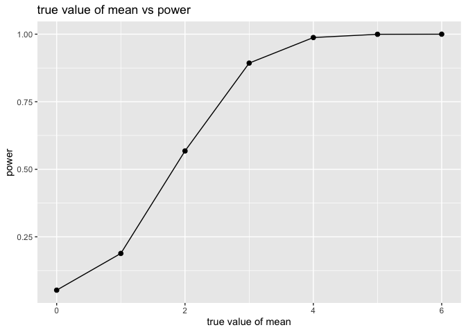
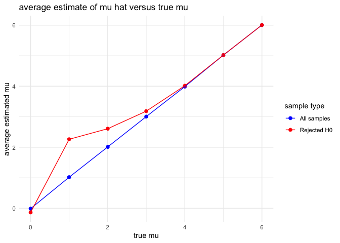

p8105_hw5_mt3866
================
2025-11-13

Load libraries

``` r
library(tidyverse)
```

    ## ── Attaching core tidyverse packages ──────────────────────── tidyverse 2.0.0 ──
    ## ✔ dplyr     1.1.4     ✔ readr     2.1.5
    ## ✔ forcats   1.0.0     ✔ stringr   1.5.1
    ## ✔ ggplot2   3.5.2     ✔ tibble    3.3.0
    ## ✔ lubridate 1.9.4     ✔ tidyr     1.3.1
    ## ✔ purrr     1.1.0     
    ## ── Conflicts ────────────────────────────────────────── tidyverse_conflicts() ──
    ## ✖ dplyr::filter() masks stats::filter()
    ## ✖ dplyr::lag()    masks stats::lag()
    ## ℹ Use the conflicted package (<http://conflicted.r-lib.org/>) to force all conflicts to become errors

``` r
library(rvest)
```

    ## 
    ## Attaching package: 'rvest'
    ## 
    ## The following object is masked from 'package:readr':
    ## 
    ##     guess_encoding

``` r
library(broom)
library(purrr)
```

Q1

Write a function that randomly draws birthdays out of 365 days

``` r
bday_sim = function(n_room) {
  
  birthdays = sample(1:365, n_room, replace = TRUE)
  repeated_bday = length(unique(birthdays)) < n_room
  repeated_bday
}
```

Run the function 10,000 times for each group size 2 to 50

``` r
bday_sim_results = 
  expand_grid(
    bdays = 2:50, 
    iter = 1:10000
  ) |> 
  mutate(
    result = map_lgl(bdays, bday_sim)
  ) |> 
  group_by(
    bdays
  ) |> 
  summarize(
    prob_repeat = mean(result)
  )
```

Plotting the results

``` r
bday_sim_results |> 
  ggplot(aes(x = bdays, y = prob_repeat)) + 
  geom_point() + 
  geom_line() +
    labs(
    x = "group size",
    y = "probability"
  )
```

<!-- -->
This plot shows that as the group size increases, the probability that
at least two people in the group will share a birthday increases as
well. These two variables seem to have a direct and positive
relationship with each other.

Q2

Follow the mean, sd, and n requirement, generate 5,000 samples. Repeat
for mu = 1 to 6 and test null

``` r
sim_test = function(n = 30, mu = 0, sigma = 5, alpha = 0.05) {
x = rnorm(n = n, mean = mu, sd = sigma)
  t_res = t.test (x, mu = 0)
  tidy(t_res) |> 
    select(estimate, p.value) |> 
    rename(mu_hat = estimate)
}


sim_results =
  expand_grid(
  mu = 0:6 ,
  iter = 1:5000) |>
  mutate(res = map2(mu, iter, ~sim_test (n = 30, mu = .x, sigma = 5)))|>
  unnest(res)

power_res = sim_results |>
  group_by(mu) |>
  summarize(power = mean(p.value < 0.05))
```

Create plot of power and mean

``` r
ggplot(power_res, aes(x = mu, y = power)) +
  geom_point(size = 2) +
  geom_line() +
  labs(
    x = "true value of mean",
    y = "power",
    title = "true value of mean vs power"
  )
```

<!-- --> As
we can see in the plot, power increases as the true mean of the sample
increases. With a larger effect size, it’s easier to detect differences
which increases the power as the significance of our results will
increase.

Plot average mean vs true value, overlay another plot

``` r
mu_summary = sim_results |>
  group_by(mu) |>
  summarize(
    avg_mu_hat = mean(mu_hat),
    avg_rejected_mu_hat = mean(mu_hat[p.value < 0.05])
  )

mu_summary_long = mu_summary |>
  pivot_longer(
    cols = c(avg_mu_hat, avg_rejected_mu_hat),
    names_to = "type",
    values_to = "average_mu_hat"
  )

ggplot(mu_summary_long, aes(x = mu, y = average_mu_hat, color = type)) +
  geom_point(size = 2) +
  geom_line() +
  scale_color_manual(
    values = c("avg_mu_hat" = "blue", "avg_rejected_mu_hat" = "red"),
    labels = c("All samples", "Rejected H0")
  ) +
  labs(
    x = "true mu",
    y = "average estimated mu",
    color = "sample type",
    title = "average estimate of mu hat versus true mu"
  ) +
  theme_minimal()
```

<!-- --> The
sample average mean for tests where the null is rejected is
approximately the same generally, however is a bit higher for lower
sample averages. The reason for this is because when the mu is small,
only the more extreme values will get rejected and this brings selection
bias, so the rejected null line is biased upwards in the beginning of
the plot in comparison to the all samples line.

Q3

To describe the raw data, there are multiple variable such as the
reported date of homicide, victim’s first and last name (separately),
their race, age, sex, city, state, latitude, longitude, and disposition.
There are 52,179 total observations in the data set.

Import homicide data & make a city_state column

``` r
  homicides = read_csv("homicide-data.csv")|>
  janitor::clean_names()|>
  mutate(city_state = str_c(city, state, sep = ","))
```

    ## Rows: 52179 Columns: 12
    ## ── Column specification ────────────────────────────────────────────────────────
    ## Delimiter: ","
    ## chr (9): uid, victim_last, victim_first, victim_race, victim_age, victim_sex...
    ## dbl (3): reported_date, lat, lon
    ## 
    ## ℹ Use `spec()` to retrieve the full column specification for this data.
    ## ℹ Specify the column types or set `show_col_types = FALSE` to quiet this message.

Summarize by city and obtain total number of homicides and unsolved
homicides

``` r
city_summary = homicides |>
  group_by(city_state) |>
  summarize(
    total_homicides = n(),
    unsolved_homicides = sum(disposition %in% c("Open/No arrest")
  )) |>
  arrange(desc(total_homicides))

city_summary
```

    ## # A tibble: 51 × 3
    ##    city_state      total_homicides unsolved_homicides
    ##    <chr>                     <int>              <int>
    ##  1 Chicago,IL                 5535               3686
    ##  2 Philadelphia,PA            3037               1268
    ##  3 Houston,TX                 2942               1147
    ##  4 Baltimore,MD               2827               1673
    ##  5 Detroit,MI                 2519               1466
    ##  6 Los Angeles,CA             2257               1106
    ##  7 St. Louis,MO               1677                865
    ##  8 Dallas,TX                  1567                676
    ##  9 Memphis,TN                 1514                433
    ## 10 New Orleans,LA             1434                832
    ## # ℹ 41 more rows

Estimate proportion of unsolved homicides. Save, use broom::tidy and
pull proportion and CI

``` r
baltimore = city_summary |>
  filter(city_state == "Baltimore,MD")
baltimore_prop = prop.test(
  x = baltimore$unsolved_homicides,
  n = baltimore$total_homicides
)
baltimore_tidy = broom::tidy(baltimore_prop)|>
  mutate(city_state = "Baltimore,MD")
baltimore_tidy |>
  select(city_state, estimate, conf.low, conf.high)|>
  knitr::kable(digits = 3)
```

| city_state   | estimate | conf.low | conf.high |
|:-------------|---------:|---------:|----------:|
| Baltimore,MD |    0.592 |    0.573 |      0.61 |

Run for each city and extract

``` r
city_props = city_summary|>
  mutate(prop_test = map2(unsolved_homicides, total_homicides, ~prop.test(.x, .y))
  )|>
  mutate(tidy_res = map(prop_test, broom::tidy))|>
  unnest(tidy_res)|>
  select(city_state, estimate, conf.low, conf.high) |>
  knitr::kable(digits = 3)
```

    ## Warning: There was 1 warning in `mutate()`.
    ## ℹ In argument: `prop_test = map2(unsolved_homicides, total_homicides,
    ##   ~prop.test(.x, .y))`.
    ## Caused by warning in `prop.test()`:
    ## ! Chi-squared approximation may be incorrect

``` r
  city_props
```

| city_state        | estimate | conf.low | conf.high |
|:------------------|---------:|---------:|----------:|
| Chicago,IL        |    0.666 |    0.653 |     0.678 |
| Philadelphia,PA   |    0.418 |    0.400 |     0.435 |
| Houston,TX        |    0.390 |    0.372 |     0.408 |
| Baltimore,MD      |    0.592 |    0.573 |     0.610 |
| Detroit,MI        |    0.582 |    0.562 |     0.601 |
| Los Angeles,CA    |    0.490 |    0.469 |     0.511 |
| St. Louis,MO      |    0.516 |    0.492 |     0.540 |
| Dallas,TX         |    0.431 |    0.407 |     0.456 |
| Memphis,TN        |    0.286 |    0.263 |     0.310 |
| New Orleans,LA    |    0.580 |    0.554 |     0.606 |
| Las Vegas,NV      |    0.287 |    0.264 |     0.312 |
| Washington,DC     |    0.383 |    0.357 |     0.410 |
| Indianapolis,IN   |    0.372 |    0.346 |     0.399 |
| Kansas City,MO    |    0.378 |    0.351 |     0.406 |
| Jacksonville,FL   |    0.390 |    0.362 |     0.419 |
| Milwaukee,wI      |    0.328 |    0.301 |     0.357 |
| Columbus,OH       |    0.457 |    0.427 |     0.487 |
| Atlanta,GA        |    0.324 |    0.295 |     0.354 |
| Oakland,CA        |    0.536 |    0.504 |     0.569 |
| Phoenix,AZ        |    0.446 |    0.414 |     0.479 |
| San Antonio,TX    |    0.324 |    0.293 |     0.357 |
| Birmingham,AL     |    0.354 |    0.321 |     0.388 |
| Nashville,TN      |    0.288 |    0.257 |     0.322 |
| Miami,FL          |    0.520 |    0.484 |     0.557 |
| Cincinnati,OH     |    0.375 |    0.339 |     0.412 |
| Charlotte,NC      |    0.236 |    0.205 |     0.270 |
| Oklahoma City,OK  |    0.469 |    0.431 |     0.507 |
| San Francisco,CA  |    0.505 |    0.467 |     0.544 |
| Pittsburgh,PA     |    0.534 |    0.494 |     0.573 |
| New York,NY       |    0.360 |    0.323 |     0.400 |
| Boston,MA         |    0.505 |    0.465 |     0.545 |
| Tulsa,OK          |    0.237 |    0.203 |     0.274 |
| Louisville,KY     |    0.453 |    0.412 |     0.495 |
| Fort Worth,TX     |    0.401 |    0.360 |     0.443 |
| Buffalo,NY        |    0.597 |    0.553 |     0.639 |
| Fresno,CA         |    0.300 |    0.260 |     0.343 |
| San Diego,CA      |    0.241 |    0.203 |     0.283 |
| Stockton,CA       |    0.574 |    0.527 |     0.621 |
| Richmond,VA       |    0.217 |    0.179 |     0.259 |
| Baton Rouge,LA    |    0.425 |    0.377 |     0.473 |
| Omaha,NE          |    0.389 |    0.342 |     0.438 |
| Albuquerque,NM    |    0.249 |    0.207 |     0.296 |
| Long Beach,CA     |    0.341 |    0.294 |     0.392 |
| Sacramento,CA     |    0.309 |    0.263 |     0.358 |
| Minneapolis,MN    |    0.426 |    0.375 |     0.479 |
| Denver,CO         |    0.394 |    0.340 |     0.451 |
| Durham,NC         |    0.326 |    0.272 |     0.385 |
| San Bernardino,CA |    0.549 |    0.488 |     0.609 |
| Savannah,GA       |    0.419 |    0.357 |     0.483 |
| Tampa,FL          |    0.418 |    0.351 |     0.489 |
| Tulsa,AL          |    0.000 |    0.000 |     0.945 |

Create the plot
